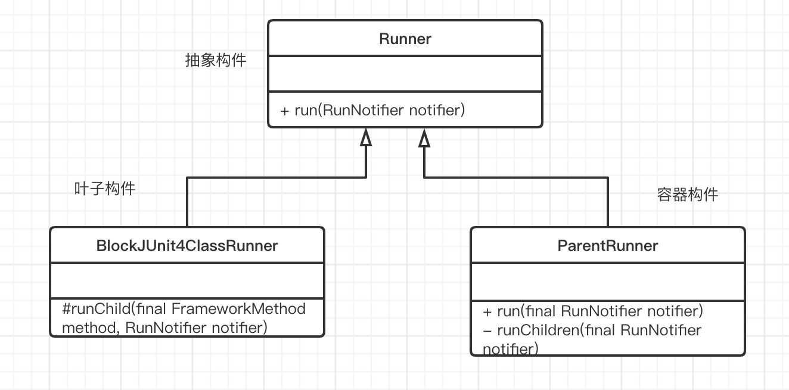

# composition design pattern in Junit

## composite 模式中的component 角色

```java
package org.junit.runner;
public abstract class Runner implements Describable {

    /**
     * Run the tests for this runner.
     *
     * @param notifier will be notified of events while tests are being run--tests being
     * started, finishing, and failing
     */
    public abstract void run(RunNotifier notifier);
}
```

## composite 模式的Composite角色

```java
package org.junit.runners;
public abstract class ParentRunner<T> extends Runner implements Filterable,
        Orderable {
    public void run(final RunNotifier notifier) {
        // ParentRunner 的入口
        EachTestNotifier testNotifier = new EachTestNotifier(notifier,
                getDescription());
        testNotifier.fireTestSuiteStarted();
        try {
            // runner 的具体实现
            Statement statement = classBlock(notifier);
            statement.evaluate();
        } catch (AssumptionViolatedException e) {
            testNotifier.addFailedAssumption(e);
        } catch (StoppedByUserException e) {
            throw e;
        } catch (Throwable e) {
            testNotifier.addFailure(e);
        } finally {
            testNotifier.fireTestSuiteFinished();
        }
    }
    // run 最终会通过各种函数调用执行runChildren
    private void runChildren(final RunNotifier notifier) {
        final RunnerScheduler currentScheduler = scheduler;
        try {
            for (final T each : getFilteredChildren()) {
                currentScheduler.schedule(new Runnable() {
                    public void run() {
                        ParentRunner.this.runChild(each, notifier);
                    }
                });
            }
        } finally {
            currentScheduler.finished();
        }
    }
}
```

## composite 模式的leaf角色

leaf角色在此案例中，并没有抽出来作为一个单独的类，而是在composite角色中定义了具体的实现

```java
package org.junit.runners;
public class BlockJUnit4ClassRunner extends ParentRunner<FrameworkMethod> {
     @Override
     // 继承自ParentRunner的类中定义了runChildren的具体实现
    protected void runChild(final FrameworkMethod method, RunNotifier notifier) {
        Description description = describeChild(method);
        if (isIgnored(method)) {
            notifier.fireTestIgnored(description);
        } else {
            Statement statement = new Statement() {
                @Override
                public void evaluate() throws Throwable {
                    methodBlock(method).evaluate();
                }
            };
            // 其具体实现是通过调用父类的runLeaf实现。所以说是在composite角色中完成了leaf角色的实际操作。
            runLeaf(statement, description, notifier);
        }
    }
}

public abstract class ParentRunner<T> extends Runner implements Filterable,
        Orderable {
    protected final void runLeaf(Statement statement, Description description,
            RunNotifier notifier) {
        EachTestNotifier eachNotifier = new EachTestNotifier(notifier, description);
        eachNotifier.fireTestStarted();
        try {
            statement.evaluate();
        } catch (AssumptionViolatedException e) {
            eachNotifier.addFailedAssumption(e);
        } catch (Throwable e) {
            eachNotifier.addFailure(e);
        } finally {
            eachNotifier.fireTestFinished();
        }
    }
}
```

## UML图



## 应用组合模式的原因

在用junit进行单元测试的时候，会构建出众多的runner，我们希望集中的有次序的执行这些runner，所以需要一个容器runners，可以对叶子节点（runner）进行管理，包括调用具体功能。但此处的组合模型ParentsRunner并不是真正的容器构件(composite)，而是继承自它的子类suite，suite是一个可以包含叶子节点（runner）和容器自身（runners）的类，但是由于suite的大部分实现继承于ParentsRunner,故以ParentsRunner对composite角色进行说明。
